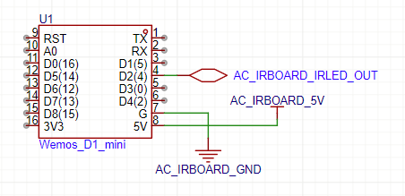
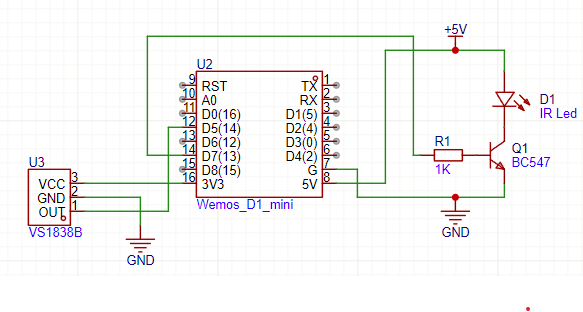

# Installation guide — PanaAC v2 (ESPHome)

## Choose a mode

This component has two modes, picked by whether you set `topic_prefix`:

- **v2 MQTT mode** — set `topic_prefix` and add a `mqtt:` block. The full-featured climate is
  exposed over the custom MQTT JSON topics (PanaAC v2 HA custom integration, single all-in-one
  card); the on-device `"<name> (v1)"` climate + a Swing Vertical select and an optional Swing Horizontal select are
  **also kept visible** on the native API. Use `esphome/esphome-panaac-v2.yaml`.
- **v1 native mode** — omit `topic_prefix`. Native `climate` (named `"<name> (v1)"`) whose
  Fan Mode carries the full fan levels (Auto / Level 1…5 / Quiet) + a Swing Vertical `select` and an optional Swing Horizontal `select`
  entities via the ESPHome native API (`api:`) / standard MQTT discovery. **No MQTT broker
  required.** Use `esphome/esphome-panaac-v2-v1mode.yaml` as the starting point. Behaves like
  PanaAC v1.

## What you need

- An ESP8266 or ESP32 module with sufficient flash (tested on a Wemos D1 mini with 4 MB).
- An IR receiver and transmitter circuit for a non-invasive installation.
- A Wi-Fi network.
- For **v2 MQTT mode** only: an MQTT broker reachable from both the ESP8266 and Home Assistant
  (Mosquitto, RabbitMQ, HiveMQ, etc.). You can use Home Assistant's built-in MQTT integration.
  **v1 native mode needs no broker.**
- An ESPHome CLI installation (`2025.9.0+`) for command-line compilation or flashing.

## Wiring
Wiring is the same as [`PanaAC_ESPHome`](https://github.com/hoangminh1109/PanaAC_ESPHome). If you are already using PanaAC v1, the hardware setup does not need to change.

With an ESP32 or ESP8266 board, there are two ways to connect the ESPHome module to your AC.

- **1. Invasive way:** You must have physical access to Panasonic AC IR board
    - Wiring Panasonic AC IR board with ESP board
        - ESP GND <-> Pana AC IR board's GND
        - ESP 5V <-> Pana AC IR board's VCC (make sure your AC IR board supplies 5V)
        - ESP GPIO <--> Pana AC IR board's IR Led output

    

- **2. Non-invasive way:** If you don't want to mod your AC IR board (invasive way), you have choice to do as below
    - Make your own IR led receiver and IR led transmitter circuit (via transistor). Refer below schematic.
    - Connect IR led receiver circuit and IR led transmitter circuit to ESP GPIOs.

    

    - Configure ESPHome yaml `remote_receiver` and `remote_transmitter` with respective GPIOs.
    - One important thing is, you have to install your ESP8266 module near the the AC indoor unit:
        - It has to be able to receive signal from physical remote same as AC unit.
        - Its IR transmitter led has to point to the AC IR module, so the command sends from it can come to the AC.
    - This way, you have to additionally configure the `panaac` climate with `ir_control: True`
- **NOTE:**
    - Method 1 brings much more stability and performance, as it captures the IR signal and feeds the control command directly to AC IR board.
    - **Recommendation:** during testing phase, you can use method 2, but for long-term usage it's highly recommended to install it as method 1.

## Clone / copy the repo

```bash
git clone https://github.com/hoangminh1109/PanaAC_v2_ESPHome.git
cd PanaAC_v2_ESPHome/esphome
```

Or copy the `esphome/components/panaac_v2/` folder into your own ESPHome project.

## Create secrets.yaml

Inside `esphome/` create a `secrets.yaml` with at least these keys:

```yaml
wifi_ssid: "YOUR_WIFI_SSID"
wifi_password: "YOUR_WIFI_PASSWORD"
wifi_ap_password: "FALLBACK_AP_PASSWORD"

mqtt_broker: "IP_OR_HOSTNAME_OF_YOUR_MQTT_BROKER"
mqtt_user: "YOUR_MQTT_USERNAME"
mqtt_pass: "YOUR_MQTT_PASSWORD"
```

The example YAML already loads these with `!secret`.

## Review the device YAML

Open `esphome-panaac-v2.yaml`. The important blocks are:

```yaml
mqtt:
  broker: !secret mqtt_broker
  username: !secret mqtt_user
  password: !secret mqtt_pass
  discovery: false
  # No birth_message/will_message/shutdown_message here — the panaac_v2 component
  # auto-configures the MQTT availability on <prefix>/availability in v2 mode.

remote_receiver:
  pin:
    number: GPIO14
    inverted: True
  tolerance: 55%
  id: ir_receiver
  idle: 5ms

remote_transmitter:
  carrier_duty_percent: 50%
  pin:
    number: GPIO13
  id: ir_transmitter

# Optional temperature sensor to report current_temperature to Home Assistant.
sensor:
  - platform: template
    name: "Room Temperature"
    id: room_temp
    lambda: return 26.5;
    update_interval: 30s
    unit_of_measurement: "°C"
    device_class: temperature

panaac_v2:
  name: "Remote Controller"
  id: panaac_v2_climate
  receiver_id: ir_receiver
  transmitter_id: ir_transmitter
  topic_prefix: "panaac_v2/esphome-panaac-v2"
  hide_legacy_comps: true  # v2 mode: hide the on-device (v1) climate + Swing V/H selects
  supports_cool: true
  supports_heat: true
  supports_fan_only: true
  supports_quiet: true
  supports_powerful: true
  supports_eco: true
  fan_5level: true
  swing_horizontal: true
  temp_step: 0.5
  ir_control: true
  sensor: room_temp  # optional
```

Adjust `topic_prefix` if you run multiple units. Omit `sensor` if you do not have
a room temperature sensor connected to the ESP8266. Set `hide_legacy_comps: true`
(v2 mode only) to hide the on-device `(v1)` climate + Swing V/H selects from
Home Assistant — the full-featured v2 climate card is provided by the PanaAC v2 HA
custom integration over MQTT, so the legacy entities would only duplicate it. It has
no effect in v1 mode, where the climate + selects are the user-facing entities.

## Climate automations

`panaac_v2` now inherits from ESPHome's core `climate` platform, so standard
automation features are available:

- `climate.control` action:

  ```yaml
  - climate.control:
      id: panaac_v2_climate
      mode: COOL
      target_temperature: 25°C
      fan_mode: "Level 2"
      swing_mode: BOTH
      preset: BOOST  # Panasonic POWERFUL; use ECO for Eco
      # Presets are valid in Auto/Cool/Dry and are mutually exclusive.
      # Granular positions use the companion selects or custom MQTT JSON.
  ```

- Lambda call:

  ```yaml
  - lambda: |-
      auto call = id(panaac_v2_climate).make_call();
      call.set_target_temperature(25.0);
      call.perform();
  ```

- `on_state` / `on_control` triggers:

  ```yaml
  panaac_v2:
    # ...
    on_state:
      - lambda: |-
          ESP_LOGD("panaac", "State updated, mode=%s", climate_mode_to_string(x.mode));
    on_control:
      - lambda: |-
          if (x.get_mode().has_value()) {
            ESP_LOGD("panaac", "Control call, mode=%s",
                      climate_mode_to_string(x.get_mode().value()));
          }
  ```

## Install

### For User
Just use your YAML with ESPHome Device Builder, and flash the generated binary to your ESP device (either wirelessly via OTA, or directly via serial port).

### For developer (advanced)

#### Compile
From the `esphome/` directory:

```bash
esphome compile esphome-panaac-v2.yaml
```

If this repository is checked out under `panaac_v2/` beside the ESPHome core workspace, use its virtual environment from this repository's `esphome/` directory:

```bash
../../esphome/.venv/bin/esphome compile esphome-panaac-v2.yaml
```

#### Flash

If your ESP8266 is connected to the build machine:

```bash
esphome upload esphome-panaac-v2.yaml
```


The compiled firmware is at `.esphome/build/esphome-panaac-v2/.pioenvs/esphome-panaac-v2/firmware.bin`.

#### Verify

1. The device should join Wi-Fi and connect to the MQTT broker.
2. Use an MQTT client (e.g. `mosquitto_sub`) to subscribe to:
   - `panaac_v2/esphome-panaac-v2/availability` — expect `online`
   - `panaac_v2/esphome-panaac-v2/traits` — expect JSON with modes
   - `panaac_v2/esphome-panaac-v2/state` — expect JSON state
3. Publish a test command:
   ```bash
   mosquitto_pub -h YOUR_BROKER -t 'panaac_v2/esphome-panaac-v2/set' \
     -m '{"fan_mode":"Level 2"}'
   ```
   You should see the IR LED flash and a new state message published.

## Next step

Install the Home Assistant custom integration from
[`PanaAC_v2_HA`](https://github.com/hoangminh1109/PanaAC_v2_HA) to add the climate card.

**NOTE**: Use the `topic_prefix` configured in ESPHome YAML to input to PanaAC_v2_HA.

## Troubleshooting

| Symptom | Likely cause |
|---------|--------------|
| Compile fails with missing `climate_ir` | You are editing the wrong component; `panaac_v2` does not depend on climate_ir. |
| No MQTT messages | Wrong broker IP or credentials; broker not reachable from the ESP8266. |
| HA integration shows unavailable | MQTT broker not configured in HA, or topic prefix mismatch. |
| IR does not transmit | `ir_control: false`, or LED wiring/driver problem. |
| State updates from physical remote do not appear | `remote_receiver` tolerance/pin/wiring issue, or non-Panasonic remote protocol. |
