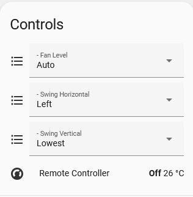
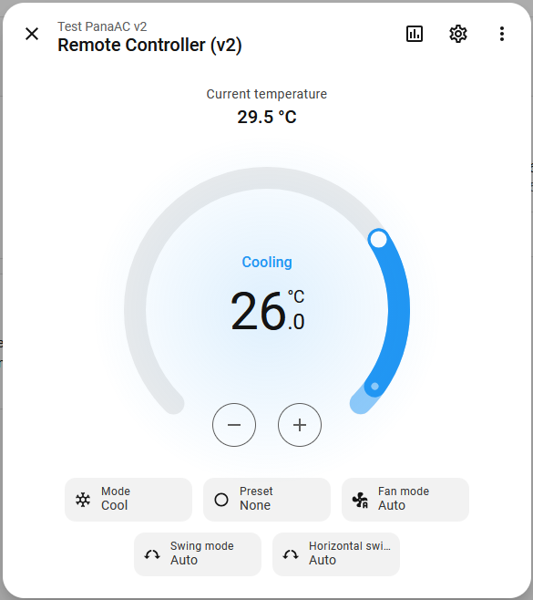
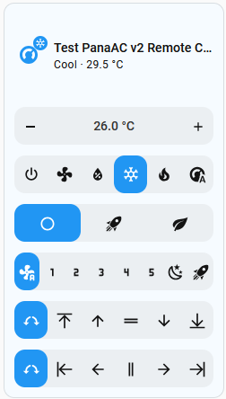

# PanaAC v2 — Panasonic AC controller for ESPHome

**_This project is maintained in my free time. A coffee ☕ is always appreciated!_**

[](https://www.buymeacoffee.com/hoangminh1109)

Custom ESPHome external component that drives a Panasonic AC over infrared.

------

This is the second generation of [`PanaAC_ESPHome`](https://github.com/hoangminh1109/PanaAC_ESPHome) (PanaAC v1). It addresses the earlier UI limitation of separate fan-level, vertical-swing, and horizontal-swing selects:

  - PanaAC v1 exposes separate fan-level, vertical-swing, and horizontal-swing selects alongside the climate entity in the ESPHome device.

    
  - PanaAC v2 combines those controls in the climate entity through the [`PanaAC_v2_HA`](https://github.com/hoangminh1109/PanaAC_v2_HA) integration, providing a cleaner climate-card UI. The native `(v1)` climate and selects remain available by default; in v2 MQTT mode, set `hide_legacy_comps: true` to hide them from Home Assistant and use only the PanaAC v2 climate entity.

     

- Implemented contributor features:
  - POWERFUL/ECO presets & `device_id` grouping (from [`@axa88`](https://github.com/axa88))
- Planned feature:
  - **[UPCOMING]** Humidity sensor support (from [`@anhthao8x`](https://github.com/anhthao8x)).

-------

It runs in **two modes**, selected by whether you set `topic_prefix` on the
`panaac_v2:` block:

- **v2 MQTT mode** (`topic_prefix` set + a `mqtt:` block) — the full-featured climate is
  exposed over custom `<prefix>/state|traits|availability|set` MQTT JSON topics, consumed by
  the [`PanaAC v2 HA custom integration`](https://github.com/hoangminh1109/PanaAC_v2_HA) as a
  single all-in-one climate card. The on-device `(v1)` climate and selects stay visible on the
  native API by default. Set `hide_legacy_comps: true` to hide them from Home Assistant.
- **v1 native mode** (`topic_prefix` omitted) — a native `climate` entity (named
  `"<name> (v1)"`) whose Fan Mode offers the full Panasonic fan levels
  (Auto / Level 1…5 / Quiet), plus a Swing Vertical `select` and, when enabled, a Swing Horizontal `select`.
  Exposed via the ESPHome native API / standard MQTT discovery. **No broker required.**
  Behaves like [`PanaAC_ESPHome`](https://github.com/hoangminh1109/PanaAC_ESPHome).

The IR encode/decode core and the canonical `ac_state` are shared between both modes. See
[DESIGN.md](DESIGN.md) for the architecture, MQTT contract, and IR protocol.

In this workspace, the custom PanaAC v2 repositories now live under
`panaac_v2/`, and the consolidated shared test workspace is
`../PanaAC_v2_Testing`.

## Features

- Panasonic IR protocol (two-frame, 27-byte) encode + decode
- Full fan levels: Auto, Level 1–5, Quiet, and conditional Powerful (3- or 5-level, configurable)
- Vertical swing positions: Auto, Highest, High, Middle, Low, Lowest
- Separate horizontal swing axis: Auto, Left Max, Left, Middle, Right, Right Max
- Optional None, Powerful, and Eco preset modes (Auto/Cool/Dry only)
- IR receiver syncs state from the physical remote
- v2 MQTT mode with retained `traits`/`state` and auto-configured availability (republished
  on every reconnect)

## Requirements

- ESP8266 or ESP32 (tested on Wemos D1 mini / ESP8266, 4 MB flash)
- ESPHome CLI `2025.9.0+`

## Installation

Load the component from the `components` folder:

```yaml
external_components:
  - source: components
```

Then add a `panaac_v2:` block. Start from an example:

- [`esphome/esphome-panaac-v2.yaml`](esphome/esphome-panaac-v2.yaml) — **v2 MQTT mode**
  (`topic_prefix` + `mqtt:`).
- [`esphome/esphome-panaac-v2-v1mode.yaml`](esphome/esphome-panaac-v2-v1mode.yaml) — **v1
  native mode** (`api:`, no `topic_prefix`, no `mqtt:` required).

See [INSTALL.md](INSTALL.md) for step-by-step hardware, compile, flash, and verify instructions
(including the required `secrets.yaml` for v2 mode).

To group the native climate and Swing V/H entities under one ESPHome sub-device, define an
ESPHome device and set `device_id` on `panaac_v2:`:

```yaml
esphome:
  devices:
    - id: hvac
      name: Living Room AC

panaac_v2:
  device_id: hvac
```

The PanaAC v2 Home Assistant integration remains a single climate entity; swing controls are not
created as separate HA swing entities.

## Configuration keys

| Key | Default | Effect |
|-----|---------|--------|
| `topic_prefix` | _(unset → v1 mode)_ | Set to enable v2 MQTT mode. Requires a `mqtt:` block. |
| `hide_legacy_comps` | false | v2 mode only: hide the on-device `(v1)` climate + selects from Home Assistant. No effect in v1 mode. |
| `receiver_id` / `transmitter_id` | required | The `remote_receiver` / `remote_transmitter` ids. |
| `supports_cool` / `supports_heat` / `supports_fan_only` | true / false / false | Advertise those HVAC modes. |
| `supports_quiet` | false | Add the Quiet fan level. |
| `supports_powerful` / `supports_eco` | false / false | Native climate advertises built-in None/Boost/Eco presets; v2 MQTT advertises None/Powerful/Eco. Powerful also adds a coupled Powerful fan mode. Presets are mutually exclusive and valid in Auto/Cool/Dry. |
| `fan_5level` | false | 5 fan levels (Level 1…5) vs 3 (Level 1/3/5). |
| `swing_horizontal` | false | Enable horizontal swing + the Swing Horizontal select. |
| `temp_step` | 1.0 | Visual temperature step (0.5 or 1.0). |
| `ir_control` | false | `true` = real IR LED (38 kHz carrier); `false` = direct-wired. |
| `sensor` | _(none)_ | Current-temperature sensor. |
| `device_id` | _(none)_ | Optional ESPHome sub-device ID shared by the native climate and Swing V/H entities. Does not create separate Home Assistant swing entities. |

> **Note:** in v2 mode the build fails if `topic_prefix` is set without a global `mqtt:` block.

## v2 MQTT topics

With `topic_prefix: panaac_v2/esphome-panaac-v2`:

| Topic | Direction | Retained |
|-------|-----------|----------|
| `availability` | device → HA | yes |
| `traits` | device → HA | yes |
| `state` | device → HA | yes |
| `set` | HA → device | no |

Commands are partial JSON, e.g. `{"fan_mode": "Level 2"}`. See [DESIGN.md](DESIGN.md) for the
full topic contract, payloads, and the reconnect-republish behaviour.

## More documentation

- [DESIGN.md](DESIGN.md) — architecture, MQTT topic contract, IR protocol, startup/reconnect
  behaviour.
- [INSTALL.md](INSTALL.md) — hardware, compile, flash, and verify.
